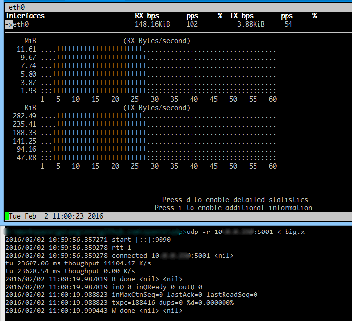
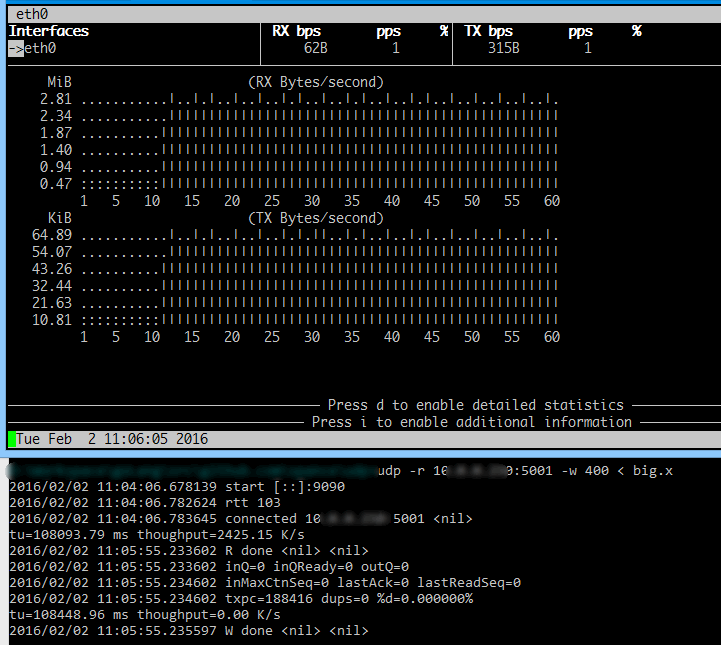
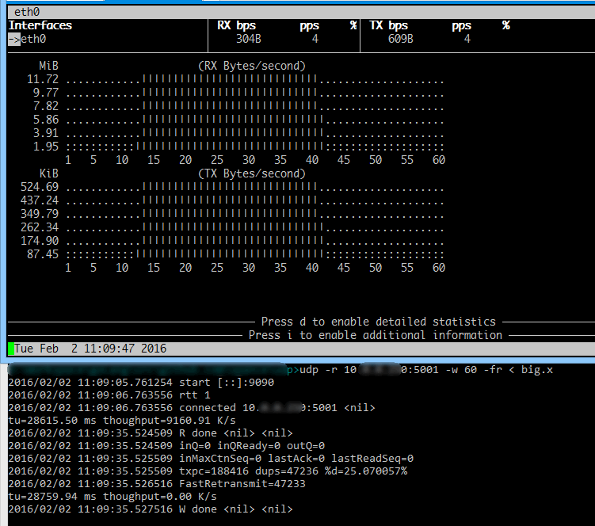

# SUFT方案测试

环境：一台win8与一台ubuntu在100Mbps局域网上测试，在ssh上用bmon观察流量。

## 1 RTT=1ms 且无丢包



（上面是接收端ssh，下面是发送端）

发送：窗口默认32，重发率0，速度跑满。

```
2016/02/02 10:59:45.380043 start [::]:5001
2016/02/02 10:59:56.479050 rtt 0
2016/02/02 10:59:56.479170 connected from 10.0.0.101:9090
tu=23627.57 ms thoughput=11094.84 K/s
2016/02/02 11:00:20.117316 W done <nil> <nil>
2016/02/02 11:00:20.117363 inQ=0 inQReady=0 outQ=0
2016/02/02 11:00:20.117399 inMaxCtnSeq=188416 lastAck=188416 lastReadSeq=188416
2016/02/02 11:00:20.117411 rxpc=188416 dups=0 %d=0.000000%
```

接收：重收率0，速度跑满。

> 1# 测试没有实际意义，但可以观察出我们的程序在理想信道上是否可以高效运转。
>
> 观察到此时百兆跑满时，cpu负载在8%左右，还有优化空间。


## 2 RTT=120ms 无丢包

clumsy模拟延迟100ms，实际测量120ms左右，并且模拟延迟后io速度受限了。



发送：速度2.4M/s 重发率0

```
2016/02/02 11:03:36.263134 start [::]:5001
2016/02/02 11:04:07.024329 rtt 122
2016/02/02 11:04:07.024807 connected from 10.0.0.101:9090
tu=108329.39 ms thoughput=2419.88 K/s
2016/02/02 11:05:55.495307 W done <nil> <nil>
2016/02/02 11:05:55.495427 inQ=0 inQReady=0 outQ=0
2016/02/02 11:05:55.495475 inMaxCtnSeq=188416 lastAck=188416 lastReadSeq=188416
2016/02/02 11:05:55.495644 rxpc=188416 dups=0 %d=0.000000%
```

接收：速度2.4M/s 重收率0

## 3 RTT=1ms 丢包率20%

用iptables产生丢包率

```
iptables -A INPUT -p udp --sport 9090 -m statistic --mode random --probability 0.2 -j DROP
```


（在20%丢包率下，理论重发率为0.2/0.8=25%）

发送：使用60窗口，速度4.6M/s 重发率24.8%

```
2016/02/02 11:06:56.722101 start [::]:5001
2016/02/02 11:07:21.581323 rtt 2
2016/02/02 11:07:21.581511 connected from 10.0.0.101:9090
tu=56925.35 ms thoughput=4605.05 K/s
2016/02/02 11:08:18.518113 W done <nil> <nil>
2016/02/02 11:08:18.518210 inQ=0 inQReady=0 outQ=0
2016/02/02 11:08:18.518248 inMaxCtnSeq=188416 lastAck=188416 lastReadSeq=188416
2016/02/02 11:08:18.518380 rxpc=188416 dups=0 %d=0.000000%
```

接收：速度4.6M/s 重收率0

（此时，接收无重复，说明发送端RTO重传判断准确）

## 4. RTT=1ms 丢包率20% 启用快速重传

和上面丢包方法一致（此时丢包率、理论重发率也同上）。



使用了-fr参数启用快速重传。

发送：使用窗口60，速度9.1M/s 重发率25%

```
2016/02/02 11:08:18.624800 start [::]:5001
2016/02/02 11:09:06.887163 rtt 2
2016/02/02 11:09:06.887285 connected from 10.0.0.101:9090
tu=28759.03 ms thoughput=9115.19 K/s
2016/02/02 11:09:35.656947 W done <nil> <nil>
2016/02/02 11:09:35.657026 inQ=0 inQReady=0 outQ=0
2016/02/02 11:09:35.657047 inMaxCtnSeq=188416 lastAck=188416 lastReadSeq=188416
2016/02/02 11:09:35.657126 rxpc=188416 dups=198 %d=0.105087%
```

接收：速度9.1M/s 重收率0.1%

(说明快速重传机制判断准确，并且明显的促进了传输吞吐。)
