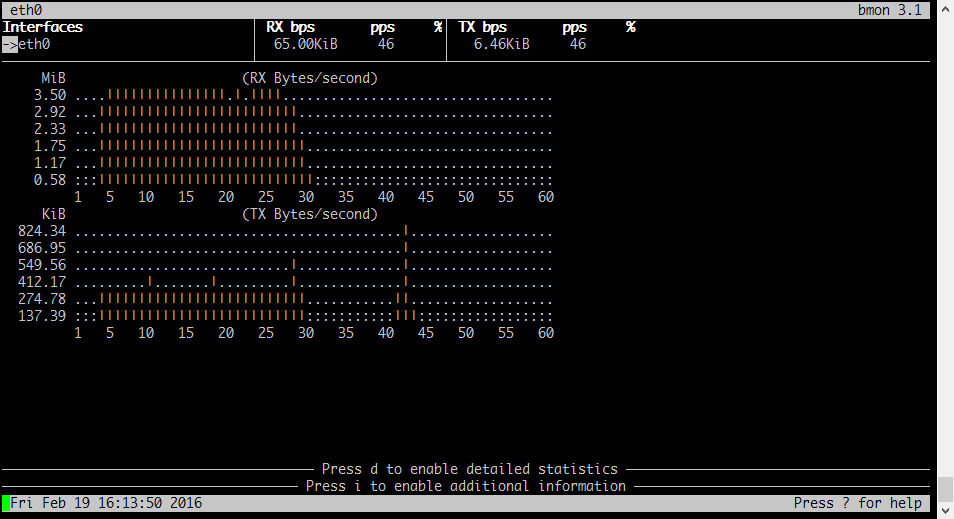
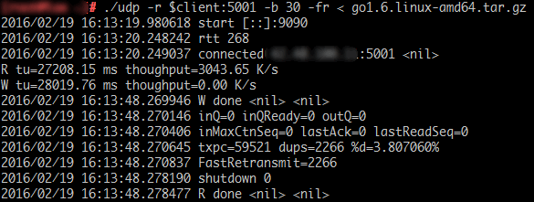
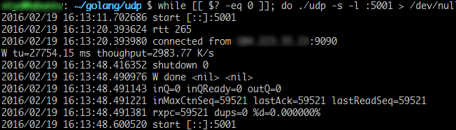
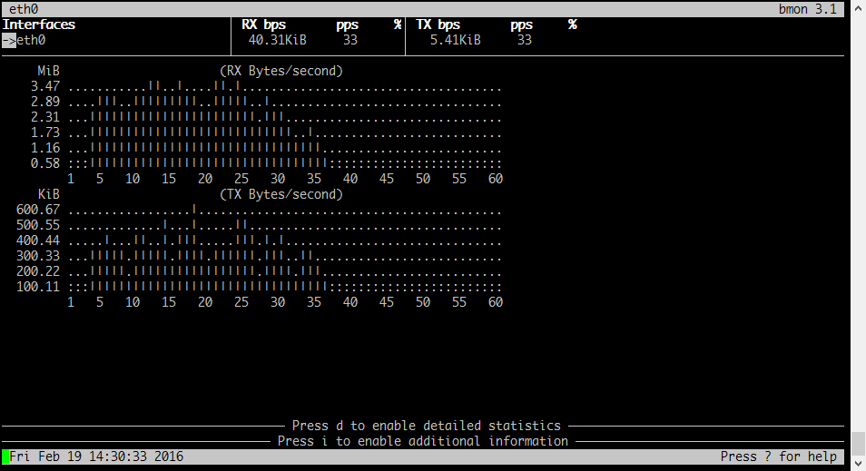
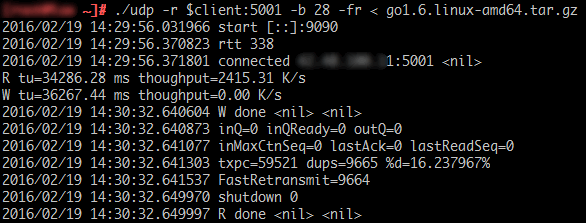
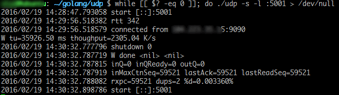
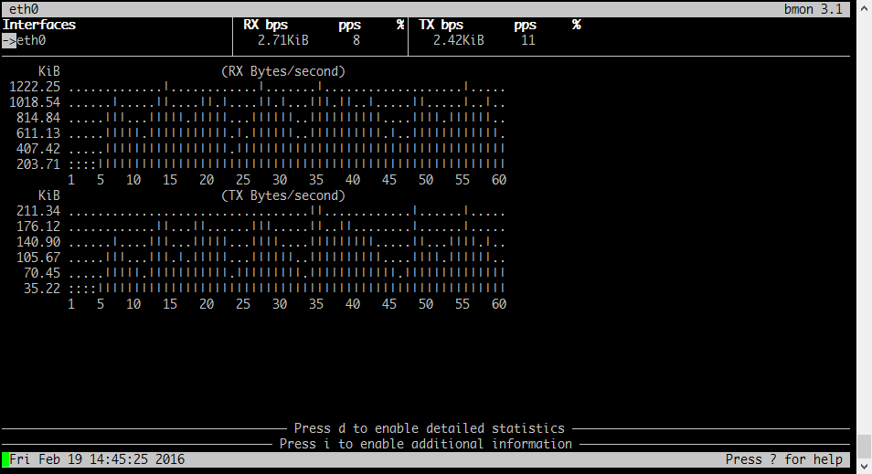
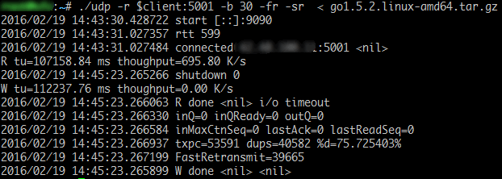
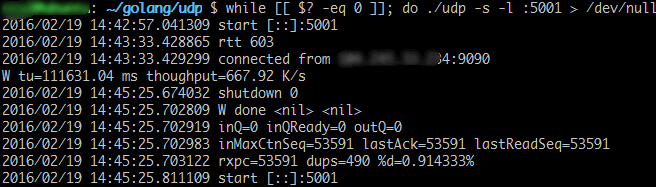

# UDP方案测试2

环境：两台Linux跨洲传输测试，远端做发送，本地端做接收，在ssh上用bmon观察流量。

# 1 高延迟 轻度丢包

## 接收侧流量



## 发送端



``` 
测得： RTT=268ms  重传率=3.8%  丢包率=3.6%  平均发送速度=3M/s
```

## 接收端



``` 
测得： RTT=265ms  平均接收速度=2.98M/s  重收率=0
```

# 2 高延迟 中度丢包

## 接收侧流量



## 发送端



``` 
测得： RTT=340ms  重传率=16%  丢包率=13.9%  平均发送速度=2.4M/s
```

## 接收端



``` 
测得： RTT=340ms  平均接收速度=2.3M/s  重收率=0.3%
```

# 3 超高延迟 超重度丢包

## 接收侧流量



## 发送端



``` 
测得： RTT=600ms  重发率=75%  丢包率=43%  平均发送速度=695K/s
```

## 接收端



``` 
测得： RTT=600ms  平均接收速度=667K/s  重收率0.9%
```